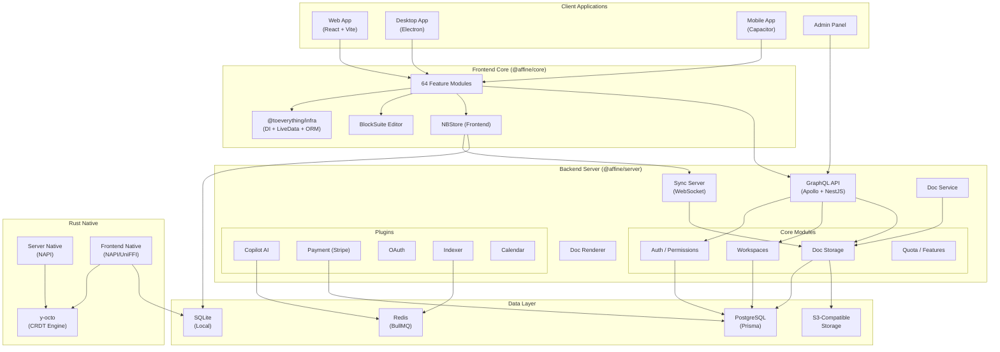

# AFFiNE Architecture Overview

> **Last Updated:** 2026-02-14

## Project Summary

**AFFiNE** is an open-source, privacy-focused knowledge management platform — a local-first alternative to Notion + Miro + Monday. It provides document editing, whiteboard drawing, and database/kanban features with real-time collaboration, all built on CRDT (Yjs) for conflict-free sync.

| Attribute        | Value                                       |
| ---------------- | ------------------------------------------- |
| Version          | 0.26.1                                      |
| License          | MIT                                         |
| Package Manager  | Yarn 4.12.0 (workspaces)                    |
| Node Requirement | < 23.0.0                                    |
| Rust Edition     | 2024                                        |
| Total Files      | ~6,072 (3,654 `.ts`, 406 `.tsx`, 149 `.rs`) |
| Packages         | 134 (npm + Cargo)                           |

### Tech Stack

| Layer      | Technology                                                           |
| ---------- | -------------------------------------------------------------------- |
| Frontend   | React 19, Jotai, vanilla-extract, Radix UI, Lit (BlockSuite), Yjs    |
| Backend    | NestJS, Prisma (PostgreSQL), Apollo GraphQL, Redis/BullMQ, Socket.IO |
| AI         | AI SDK (OpenAI, Anthropic, Google Vertex, Perplexity), Fal.ai, MCP   |
| Payments   | Stripe                                                               |
| Native     | Rust (NAPI-RS for Node/Electron, UniFFI for mobile), SQLite          |
| Desktop    | Electron                                                             |
| Mobile     | Capacitor (iOS + Android), UniFFI (Rust native)                      |
| Testing    | Vitest (unit), Playwright (E2E), Ava (server)                        |
| Build      | Vite, SWC, custom `affine` CLI                                       |
| Monitoring | OpenTelemetry (traces, metrics), Sentry, Mixpanel                    |

---

## Repository Layout

```
AFFINE/
├── blocksuite/              # Editor framework (Lit-based block editor)
│   ├── affine/              # AFFiNE-specific blocks & components
│   │   ├── blocks/          # Block implementations (paragraph, list, code, etc.)
│   │   ├── components/      # Shared UI components for blocks
│   │   ├── data-view/       # Database/kanban/table views
│   │   ├── gfx/             # Graphics layer (whiteboard, shapes)
│   │   ├── model/           # Data models & schemas
│   │   ├── shared/          # Shared utilities & types
│   │   └── widgets/         # Toolbar, slash menu, etc.
│   ├── framework/           # Core framework
│   │   ├── global/          # Global types & utils
│   │   ├── std/             # Standard library
│   │   ├── store/           # Document store (Yjs-backed)
│   │   └── sync/            # Sync providers
│   └── playground/          # Dev playground
├── packages/
│   ├── backend/
│   │   ├── native/          # Rust native bindings for server (NAPI)
│   │   └── server/          # NestJS server application
│   ├── common/
│   │   ├── debug/           # Debug utilities
│   │   ├── env/             # Environment configuration
│   │   ├── error/           # Error types
│   │   ├── graphql/         # Auto-generated GraphQL client
│   │   ├── infra/           # @toeverything/infra — DI framework, LiveData, ORM
│   │   ├── native/          # Shared Rust native code
│   │   ├── nbstore/         # Notebook storage abstraction
│   │   ├── reader/          # Document reader/parser
│   │   ├── s3-compat/       # S3-compatible storage
│   │   └── y-octo/          # Rust CRDT implementation (Yjs-compatible)
│   └── frontend/
│       ├── admin/           # Admin panel (React)
│       ├── apps/            # Application entry points
│       │   ├── web/         # Web app
│       │   ├── electron/    # Desktop app (Electron)
│       │   ├── mobile/      # Mobile web
│       │   ├── ios/         # iOS app (Capacitor)
│       │   └── android/     # Android app (Capacitor)
│       ├── component/       # Shared React UI components
│       ├── core/            # Core application logic (64 modules)
│       ├── i18n/            # Internationalization
│       ├── native/          # Rust bindings for desktop/mobile
│       ├── routes/          # Route definitions
│       ├── templates/       # Document templates
│       └── track/           # Analytics/telemetry
├── tests/                   # E2E and integration tests
├── tools/                   # Developer tooling & CLI
├── scripts/                 # Build & setup scripts
└── docs/                    # Project documentation
```

---

## Architecture Diagram



---

## Key Patterns & Conventions

### Module Pattern

- **Backend:** NestJS modules with `AppModuleBuilder` pattern supporting "flavors" (`graphql`, `sync`, `doc`, `renderer`, `front`). Modules are conditionally loaded via `useIf()`.
- **Frontend:** Each feature is a self-contained module registered via `configure<Name>Module(framework)` using the `@toeverything/infra` DI framework.

### Naming Conventions

- Packages use `@affine/*` scope for app code, `@blocksuite/*` for editor, `@toeverything/*` for infra
- Files: `kebab-case` for directories and files, PascalCase for React components
- `.css.ts` files for vanilla-extract styles
- `.spec.ts` / `.spec.tsx` for unit tests, `.e2e.ts` for E2E tests

### Data Flow

- **Local-first:** Documents stored as Yjs CRDTs synced via WebSocket
- **NBStore:** Abstraction layer for blob/doc storage with multiple backends (IndexedDB, SQLite, Cloud)
- **LiveData:** Reactive state management (similar to RxJS observables) used throughout infra

---

## Build & Dev Setup

```bash
# Install dependencies
yarn install

# Development (runs web app)
yarn dev

# Build all
yarn build

# Run tests
yarn test              # Vitest (unit)
yarn test:ui           # Vitest UI

# Linting
yarn lint              # ESLint + Prettier
yarn lint:fix          # Auto-fix

# Type checking
yarn typecheck         # tsc -b
```

### Server development

```bash
cd packages/backend/server
yarn dev               # Starts NestJS with nodemon
yarn test              # Ava tests
```

### Key environment variables

- `AFFINE_ENV` — `dev` / `production`
- `SERVER_FLAVOR` — `graphql` / `sync` / `doc` / `renderer` / `front` / `script`
- `AFFINE_SERVER_EXTERNAL_URL` — Public URL for the server
