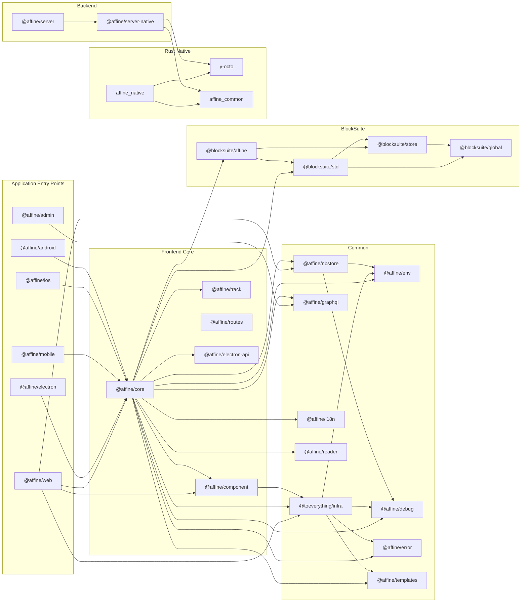
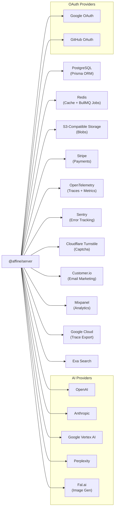
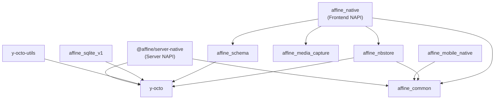

# Dependency Map

> **Last Updated:** 2026-02-14

## Inter-Module Dependency Graph

---

## Shared Package Usage

These packages are consumed by most of the monorepo:

| Shared Package        | Dependents                                                                                                                                  |
| --------------------- | ------------------------------------------------------------------------------------------------------------------------------------------- |
| `@toeverything/infra` | `@affine/core`, `@affine/web`, `@affine/electron`, `@affine/mobile`, `@affine/ios`, `@affine/android`, `@affine/component`, `@affine/admin` |
| `@affine/env`         | `@toeverything/infra`, `@affine/core`, most frontend packages                                                                               |
| `@affine/debug`       | `@toeverything/infra`, `@affine/core`, `@affine/nbstore`                                                                                    |
| `@affine/error`       | `@toeverything/infra`, `@affine/core`                                                                                                       |
| `@affine/graphql`     | `@affine/core`, `@affine/admin`, `@affine/server` (dev)                                                                                     |
| `yjs`                 | `@toeverything/infra`, `@affine/core`, `@affine/server`, `@blocksuite/store`                                                                |

---

## External Service Integrations

---

## Rust Crate Dependencies

