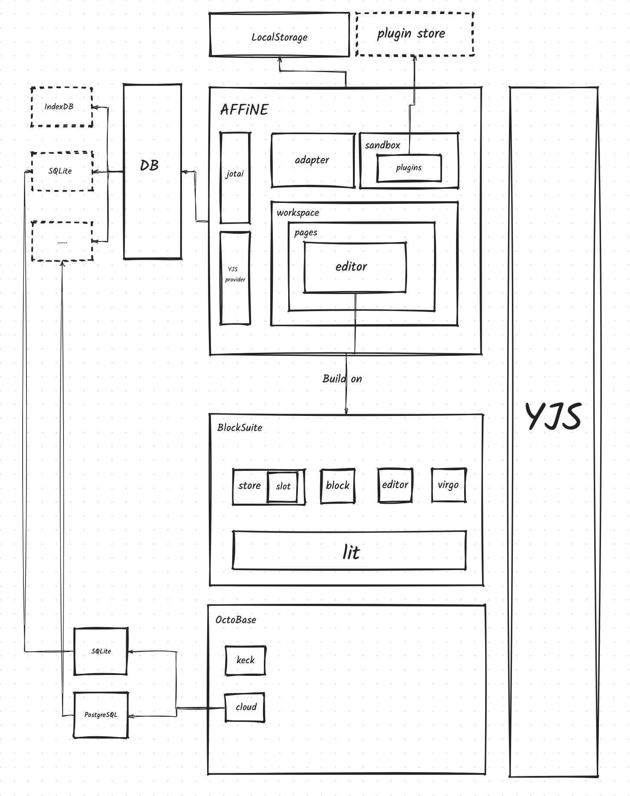

# High Level AFFiNE Architecture

# Concepts

## Jotai

AFFiNE use Jotai as state management tool, Jotai is so important because AFFiNE saved many useful and important information in Jotai, such as:

- adapters
- workspace
- page
- plugins
- ...

Sometimes Jotai more like a middleware between AFFiNE and network & persistent. AFFiNE will get data from persistent and network(with cloud) then store them in Jotai.

## Adapter

Adapter defined a set of preset for workspace, they are separated by `flavor`: local / cloud / public.

And each kind of workspace adapter defined some functionality and components to adapt, just like: UI components / events / CRUD functions, etc.

## Plugin

AFFiNE is building a VSCode like plugin ecosystem. It's framework-agnostic and use [SES](https://github.com/endojs/endo/tree/master/packages/ses#readme) to build sandbox for plugins.

There will be a plugin store in the future to let users install plugins from community and AFFiNE.

## Workspace & Page & Editor

A workspace could include multiple pages, pages in different workspace are independent.

And you can switch page view between `Edgeless Mode` and `Page Mode`. Since AFFiNE is built on [BlockSuite](https://blocksuite.affine.pro/), all content within editor are block based.

Details about editor can refer to [BlockSuite document](https://blocksuite.affine.pro/).

## Collaborative

Since AFFiNE use Yjs document as main data structure, Collaborative is part of AFFiNE's DNA, even though cloud feature is not ready yet(It will be ready several days later).

This part of feature will be supported by [OctoBase](https://octobase.pro/).

# Reference

All the concepts in this doc just a brief introduction, if you want to learn more about them, please refer to these useful links.

1. [BlockSuite](https://blocksuite.affine.pro/)
2. [OctoBase](https://octobase.pro/)
3. [Jotai](https://jotai.org/)
4. [Yjs](https://docs.yjs.dev/)
5. [SES](https://github.com/endojs/endo/tree/master/packages/ses#readme)
