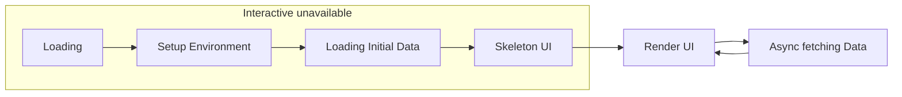
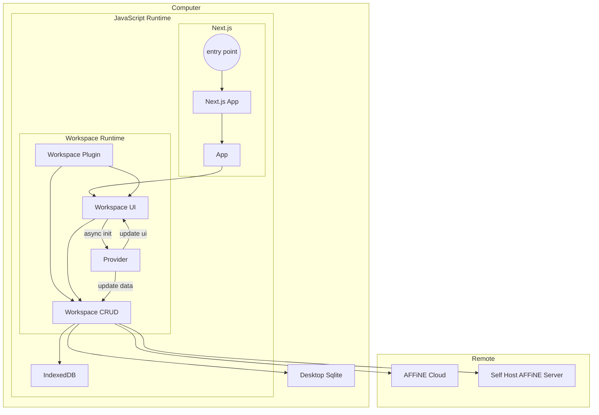

# Behind the code - Code Design and Architecture of the AFFiNE platform

## Introduction

This document delves into the design and architecture of the AFFiNE platform, providing insights for developers interested in contributing to AFFiNE or gaining a better understanding of our design principles.

## Addressing the Challenge

AFFiNE is a platform designed to be the next-generation collaborative knowledge base for professionals. It is local-first, yet collaborative; It is robust as a foundational platform, yet friendly to extend. We believe that a knowledge base that truly meets the needs of professionals in different scenarios should be open-source and open to the community. By using AFFiNE, people can take full control of their data and workflow, thus achieving data sovereignty. 
To do so, we should have a stable plugin system that is easy to use by the community and a well-modularized editor for customizability. Let's list the challenges from the perspective of data modeling, UI and feature plugins, and cross-platform support.

### Data might come from anywhere and go anywhere, in spite of the cloud

AFFiNE provides users with flexibility and control over their data storage. Our platform is designed to prioritize user ownership of data, which means data in AFFiNE is always accessible from local devices like a laptop's local file or the browser's indexedDB. In the mean while, data can also be stored in centralised cloud-native way.

Thanks to our use of CRDTs (Conflict-free Replicated Data Types), data in AFFiNE is always conflict-free, similar to a auto-resolve-conflict Git. This means that data synchronization, sharing, and real-time collaboration are seamless and can occur across any network layer so long as the data as passed. As a result, developers do not need to worry about whether the data was generated locally or remotely, as CRDTs treat both equally.

While a server-centric backend is supported with AFFiNE, it is not suggested. By having a local-first architecture, AFFiNE users can have real-time responsive UI, optimal performance and effortlessly synchronize data across multiple devices and locations. This includes peer-to-peer file replication, storing file in local or cloud storage, saving it to a server-side database, or using AFFiNE Cloud for real-time collaboration and synchronization.

### Customizable UI and features

AFFiNE is a platform, meaning the user can customize the UI and features of each part.

We need to consider the following cases:

- Pluggable features. Some features can be disabled or enabled. For example, people for personal use might not need authentication or collaboration features. The enterprise user may want to have authentication and strong security.
- SDK for the developers, the developers can build their features and plugins for AFFiNE. Like AI writing support, self-hosted database, or features for the specific domain.

### Diverse platforms

AFFiNE has to support different platforms, which means the user can use AFFiNE on devices like Desktop, mobile, and web.

Some features might be different on different platforms. For example, the desktop version might have file system support.

## The solution

### Loading Mechanism

The AFFiNE is built on the web platform, meaning that most code runs on the JavaScript runtime(v8, QuickJS).
Some interfaces, like in the Desktop, will be implemented in the native code like Rust.

But eventually, the main logic of AFFiNE is running on the JavaScript runtime. Since it is a single-threaded runtime, we need to ensure that the code is running in a non-blocking way.

Some logic has to be running in the blocking way.

We have to set up the environment before starting the core.
And for the Workspace, like local workspace or cloud workspace, we have to load the data from the storage before rendering the UI.

During this period, there will be transition animation and skeleton UI.



In this way, we need to boost the performance of the loading process.

The initial data is the most costly part of the process.
We must ensure that the initial data is loaded as quickly as possible.

Here is an obvious conclusion that only one Workspace is active simultaneously in one browser.
So we need to load the data of the active Workspace as the initial data.
And other workspaces can be loaded in the background asynchronously.

For example, the local Workspace is saved in the browser's indexedDB.

One way to boost the performance is to use the Web Worker to load the data in the background.

Here is one pseudocode:

```tsx
// worker.ts
import { openDB } from 'idb';

const db = await openDB('local-db' /* ... */);
const data = await db.getAll('data');
self.postMessage(data);
// main.ts
const worker = new Worker('./worker.ts', { type: 'module' });

await new Promise<Data>(resolve => {
  worker.addEventListener('message', e => resolve(e.data));
});

// ready to render the UI
renderUI(data);
```

We use React Suspense to deal with the initial data loading in the real code.

```tsx
import { atom, useAtom, useAtomValue, useSetAtom } from 'jotai';

const currentWorkspaceIdAtom = atom(null);
const currentWorkspaceAtom = atom<Workspace>(async get => {
  const workspaceId = await get(currentWorkspaceIdAtom);
  // async load the workspace data
  return Workspace;
});

const Workspace = () => {
  const currentWorkspace = useAtomValue(currentWorkspaceAtom);
  return <WorkspaceUI workspace={currentWorkspace} />;
};

const App = () => {
  const router = useRouter();
  const workspaceId = router.query.workspaceId;
  const [currentWorkspaceId, set] = useAtom(currentWorkspaceIdAtom);
  if (!currentWorkspaceId) {
    set(workspaceId);
    return <Loading />;
  }
  return (
    <Suspense fallback={<Skeleton />}>
      <Workspace />
    </Suspense>
  );
};
```

### Data Storage and UI Rendering

We assume that the data is stored in different places and loaded differently.

In the current version, we have two places to store the data: local and Cloud storage.

The local storage is the browser's indexedDB, the default storage for the local Workspace.

The cloud storage is the AFFiNE Cloud, which is the default storage for the cloud workspace.

But since the Time to Interactive(TTI) is the most important metric for performance and user experience,
all initial data is loaded in the indexedDB.

And other data will be loaded and updated in the background.

With this design concept, we have the following data structure:

```ts
import { Workspace as Store } from '@blocksuite/store';

interface Prpvider {
  type: 'local-indexeddb' | 'affine-cloud' | 'desktop-sqlite';
  background: boolean; // if the provider is background, we will load the data in the background
  necessary: boolean; // if the provider is necessary, we will block the UI rendering until this provider is ready
}

interface Workspace {
  id: string;
  store: Store;
  providers: Provider[];
}
```

The `provider` is a connector that bridges the current data in memory and the data in another place.

You can combine different providers to build different data storage and loading strategy.

For example, if there is only have `affine-cloud`,
the data will be only loaded from the Cloud and not saved in the local storage,
which might be useful for the enterprise user.

Also, we want to distinguish the different types of Workspace.
Even though the providers are enough for the Workspace, when we display the Workspace in the UI, we need to know the type of Workspace.
AFFiNE Cloud Workspace needs user authentication; the local Workspace does not need it.

And there should have a way to create, read, update, and delete the Workspace.

Hence, we combine all details of the Workspace as we mentioned above into the `WorkspacePlugin` type.

```ts
import React from 'react';

interface UI<WorkspaceType> {
  DetailPage: React.FC<UIProps<WorkspaceType>>;
  SettingPage: React.FC<UIProps<WorkspaceType>>;
  SettingPage: React.FC<UIProps<WorkspaceType>>;
}

interface CRUD<WorkspaceType> {
  create: () => Promise<WorkspaceType>;
  read: (id: string) => Promise<WorkspaceType>;
  list: () => Promise<WorkspaceType[]>;
  delete: (Workspace: WorkspaceType) => Promise<WorkspaceType>;
}

interface WorkspacePlugin<WorkspaceType> {
  type: WorkspaceType;
  ui: UI<WorkspaceType>;
  crud: CRUD<WorkspaceType>;
}
```



Notice that we do not assume the Workspace UI has to be written in React.js(for now, it has to be),
In the future, we can support other UI frameworks instead, like Vue and Svelte.
