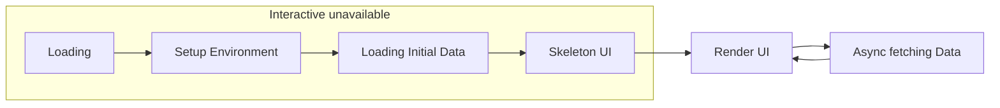
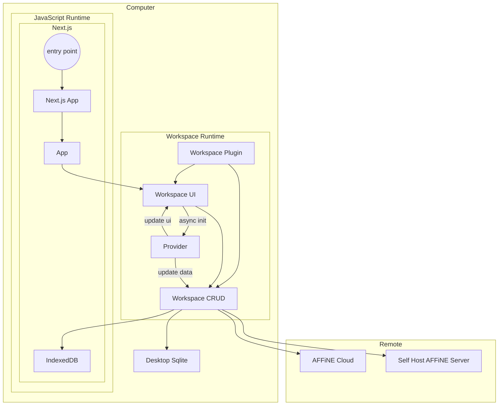

# Behind the code - Code Design and Architecture of AFFiNE platform

## Introduction

This document talks about the design and architecture of AFFiNE platform.
Which might be helpful for the developers who want to contribute to AFFiNE and want to understand the principles of the design.

## Facing the problem

AFFiNE is a platform that for the next-generation collaborative knowledge base for professionals.
We might have many difficulties to build a platform that can be used by different users with different needs.

### Data might from anywhere, and might go anywhere

There are many different types of data that can be stored in AFFiNE, which might be saved
in the different places.

For example,
the user
who wants
to have privacy first can save their data in their own local device(like in the browser's indexedDB or local file of laptop).
Or the user who wants to share their data with others, can save their data in the AFFiNE Cloud.
Or the user who want to share their data with others,
but also want to have privacy, they can setup their own AFFiNE Cloud server.

### Customizable UI and features

AFFiNE is a platform, which means that the user can customize the UI and features of each part.

We need to consider the following cases:

- Pluggable features, some features can be disabled or enabled for example the people for personal use might not need the authentication or collaboration features. Or the enterprise user might want to have the authentication and strong security.
- SDK for the developers, the developers can build their own features and plugins for AFFiNE. like AI writing support, self-hosted database, or the features for the specific domain.

### Diverse platforms

AFFiNE have to support the different platforms, which means that the user can use AFFiNE on the different devices like desktop, mobile, and web.

Some features might be different on different platforms, for example, desktop version might have the file system support.

## The solution

### Loading Mechanism

Basically, the AFFiNE is built on the web platform, which means that the most code is running on the JavaScript runtime(v8, QuickJS, etc).
Some interfaces like in the Desktop will be implemented in the native code like Rust.

But eventually, the main logic of AFFiNE is running on the JavaScript runtime. Since it's a single-threaded runtime, we need to make sure that the code is running in the non-blocking way.

Some logic has to be running in the blocking way.

We have to set up the environment before starting the core.
And for the workspace, like local workspace or cloud workspace, we have to load the data from the storage before rendering the UI.

During this period, there will be transition animation and skeleton UI.



In this way, we need to boost the performance of the loading process.

THe initial data is the most costly part during the process.
We need to make sure that the initial data is loaded as fast as possible.

Here is an obvious conclusion that there's only one workspace is active at the same time in one browser.
So we just need to load the data of the active workspace as the initial data.
And other workspaces can be loaded in the background asynchronously.

For example, the local workspace is saved in the browser's indexedDB.

One way to boost the performance is to use the Web Worker to load the data in the background.

Here is one pseudocode:

```tsx
// worker.ts
import { openDB } from 'idb';

const db = await openDB('local-db' /* ... */);
const data = await db.getAll('data');
self.postMessage(data);
// main.ts
const worker = new Worker('./worker.ts', { type: 'module' });

await new Promise<Data>(resolve => {
  worker.addEventListener('message', e => resolve(e.data));
});

// ready to render the UI
renderUI(data);
```

In the real code in AFFiNE. We use React Suspense to deal with the initial data loading.

```tsx
import { atom, useAtom, useAtomValue, useSetAtom } from 'jotai';

const currentWorkspaceIdAtom = atom(null);
const currentWorkspaceAtom = atom<Workspace>(async get => {
  const workspaceId = await get(currentWorkspaceIdAtom);
  // async load the workspace data
  return workspace;
});

const Workspace = () => {
  const currentWorkspace = useAtomValue(currentWorkspaceAtom);
  return <WorkspaceUI workspace={currentWorkspace} />;
};

const App = () => {
  const router = useRouter();
  const workspaceId = router.query.workspaceId;
  const [currentWorkspaceId, set] = useAtom(currentWorkspaceIdAtom);
  if (!currentWorkspaceId) {
    set(workspaceId);
    return <Loading />;
  }
  return (
    <Suspense fallback={<Skeleton />}>
      <Workspace />
    </Suspense>
  );
};
```

### Data Storage and UI Rendering

We assume that the data is stored in different places and loaded in different ways.

In the current version, we have two places to store the data, which is the local storage and the cloud storage.

The local storage is the browser's indexedDB, which is the default storage for the local workspace.

The cloud storage is the AFFiNE Cloud, which is the default storage for the cloud workspace.

But since the Time to Interactive(TTI) is the most important metric for the performance and user experience,
all initial data is loaded in the indexedDB.

And other data will be loaded and updated in the background.

With this design concept, we have the following data structure:

```ts
import { Workspace as Store } from '@blocksuite/store';

interface Prpvider {
  type: 'local-indexeddb' | 'affine-cloud' | 'desktop-sqlite';
  background: boolean; // if the provider is background, we will load the data in the background
  necessary: boolean; // if the provider is necessary, we will block the UI rendering until this provider is ready
}

interface Workspace {
  id: string;
  store: Store;
  providers: Provider[];
}
```

the `provider` is a connector that builds the bridge between the current data in memory to the data in the other place.

You can combine different providers to build the different data storage and loading strategy.

For example, if there is only have `affine-cloud`,
the data will be only loaded from the cloud and not saved in the local storage,
which might useful for like the enterprise user.

Also, we want to distinguish the different types of workspace.
Even though the providers are enough for the workspace.
But when we display the workspace in the UI, we need to know the type of the workspace.
AFFiNE Cloud Workspace needs user authentication, and the local workspace doesn't need it.

And there should have a way to create, read, update, and delete the workspace.

Hence, we combine all details of the workspace as we mentioned above into the `WorkspacePlugin` type.

```ts
import React from 'react';

interface UI<WorkspaceType> {
  DetailPage: React.FC<UIProps<WorkspaceType>>;
  SettingPage: React.FC<UIProps<WorkspaceType>>;
  SettingPage: React.FC<UIProps<WorkspaceType>>;
}

interface CRUD<WorkspaceType> {
  create: () => Promise<WorkspaceType>;
  read: (id: string) => Promise<WorkspaceType>;
  list: () => Promise<WorkspaceType[]>;
  delete: (workspace: WorkspaceType) => Promise<WorkspaceType>;
}

interface WorkspacePlugin<WorkspaceType> {
  type: WorkspaceType;
  ui: UI<WorkspaceType>;
  crud: CRUD<WorkspaceType>;
}
```



Notice that we don't assume the Workspace UI has to be written in React.js(for now it has to be),
we can support other UI frameworks instead like Vue, Svelte, etc. in the future.
