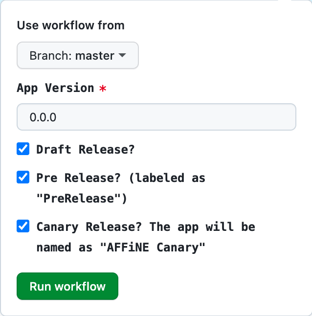

## AFFiNE Release Process

## Who can make a release?

The AFFiNE core team gives release authorization. And also have the following requirements.

- Have commit access to the AFFiNE repository.
- Have access to GitHub Actions.

## How to make a release?

Before releasing, ensure you have the latest version of the `master` branch.

And Read the semver specification to understand how to version your release. https://semver.org

### 1. Update the version in `package.json`

```shell
./scripts/set-version.sh 0.5.4-canary.5
```

### 2. Commit changes and push to `master`

```shel
git add .
# vx.y.z-canary.n
git commit -m "v0.5.4-canary.5"
git push origin master
```

### 3. Create a release action

Create a release action in the [Release Desktop App](https://github.com/toeverything/AFFiNE/actions/workflows/release-desktop-app.yml).



Select the correct branch and fill out the form, then click `Run workflow`.

### 4. Publish the release

After the release action is completed, you can see the draft release on the [release page](https://github.com/toeverything/AFFiNE/releases).

You can edit the release note and publish it.

Remember that the release tag and title should be the same as the version in `package.json`.

And target the release to that commit you just pushed.
