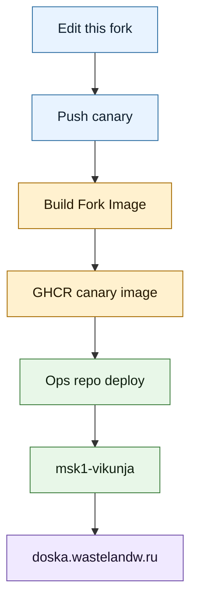

# Fork Deploy

## Назначение

Этот документ описывает, как этот fork (форк) `AFFiNE` попадает в production (боевую среду) `doska.wastelandw.ru`.

Главный принцип: VPS (виртуальный сервер) ничего не собирает. Build (сборка) идет в GitHub Actions (CI, непрерывная интеграция), затем `msk1-vikunja` скачивает готовый Docker image (образ Docker) из GHCR (GitHub Container Registry).

## Текущий контур



Смысл схемы: этот repo (репозиторий) отвечает за исходники и image (образ), а ops repo (репозиторий эксплуатации) отвечает за deploy (выкладку) на сервер.

Текущие значения:

- fork repo (репозиторий форка): `https://github.com/z0rgoyok/AFFiNE`;
- upstream repo (исходный репозиторий): `https://github.com/toeverything/AFFiNE`;
- deploy branch (ветка выкладки): `canary`;
- build workflow (сценарий сборки): `.github/workflows/build-fork-image.yml`;
- reusable image workflow (переиспользуемый сценарий образа): `.github/workflows/build-images.yml`;
- published image (публикуемый образ): `ghcr.io/z0rgoyok/affine:canary`;
- production domain (боевой домен): `doska.wastelandw.ru`;
- production host (боевой хост): `msk1-vikunja`;
- remote app dir (каталог приложения на сервере): `/opt/apps/affine`;
- ops repo: `/Users/deniszabozhanov/dev/tools/vps-vpn-ops`;
- ops host file (файл хоста): `hosts/msk1-vikunja.env`;
- ops deploy command (команда выкладки): `make deploy-affine HOST_FILE=hosts/msk1-vikunja.env`.

## Что уже изменено в fork

В `.github/workflows/build-images.yml` image tag (тег образа) использует owner (владельца) fork:

```yaml
tags: ghcr.io/${{ github.repository_owner }}/affine:${{inputs.build-type}}-${{ inputs.git-short-hash }}
```

Это дает `ghcr.io/z0rgoyok/affine:canary-<git-short-hash>` вместо upstream-адреса `ghcr.io/toeverything/affine:*`.

В `.github/workflows/build-fork-image.yml` есть отдельный workflow (сценарий) для fork:

- запускается на `push` в `canary`;
- запускается вручную через `workflow_dispatch`;
- вычисляет `app-version` как `<package.json version>-canary.<git-short-hash>`;
- вызывает `.github/workflows/build-images.yml`;
- после сборки ставит deploy tag (тег выкладки) `ghcr.io/z0rgoyok/affine:canary`.

`app-version` обязан начинаться с актуальной версии из `package.json`. Клиент `AFFiNE` сравнивает server version (версию сервера) с минимальной поддерживаемой версией, поэтому искусственная версия вида `0.0.0-canary.<hash>` ломает sign in (вход) с сообщением `not compatible with current client`.

В `.github/workflows/build-images.yml` убран `environment: ${{ inputs.build-type }}` для build jobs (задач сборки). Это важно: с `environment: canary` workflow в fork висел в `Queued`, потому что GitHub ждал environment gate (разрешение окружения).

## Обычный маршрут правки

1. Работать в этом repo:

```bash
cd /Users/deniszabozhanov/dev/tools/AFFiNE
git status --short
git branch --show-current
```

Ожидаемая ветка: `canary`.

2. Внести правку в код.

3. Запустить проверки, относящиеся к измененным пакетам.

Практический порядок выбора проверок:

- смотреть ближайший `package.json`;
- смотреть root scripts (корневые скрипты) в `package.json`;
- для backend (бэкенда) проверять server package (серверный пакет);
- для web UI (веб-интерфейса) проверять frontend package (фронтенд-пакет);
- для workflow-only (только CI) правок проверять YAML (YAML) и запуск GitHub Actions.

4. Закоммитить и отправить в fork:

```bash
git status --short
git add <changed-files>
git commit -m "<short message>"
git push origin canary
```

5. Дождаться GitHub Actions:

```bash
gh run list --repo z0rgoyok/AFFiNE --workflow "Build Fork Image" --limit 5
gh run watch <run-id> --repo z0rgoyok/AFFiNE --exit-status
```

Успешный workflow (сценарий) публикует:

- immutable image (неизменяемый образ): `ghcr.io/z0rgoyok/affine:canary-<git-short-hash>`;
- deploy image (образ выкладки): `ghcr.io/z0rgoyok/affine:canary`.

6. Проверить manifest (манифест) образа:

```bash
docker buildx imagetools inspect ghcr.io/z0rgoyok/affine:canary
```

Ожидаемые platforms (платформы): `linux/amd64`, `linux/arm64`, `linux/arm/v7`.

7. Развернуть через ops repo:

```bash
cd /Users/deniszabozhanov/dev/tools/vps-vpn-ops
make deploy-affine HOST_FILE=hosts/msk1-vikunja.env
```

Deploy script (скрипт выкладки) в ops repo фиксирует `AFFINE_IMAGE=ghcr.io/z0rgoyok/affine:canary` в `/opt/apps/affine/.env`, скачивает свежий образ и перезапускает сервис.

## Ручная пересборка текущей ветки

Когда код уже в `canary`, а нужен rebuild (пересборка) без нового commit (коммита):

```bash
gh workflow run "Build Fork Image" --repo z0rgoyok/AFFiNE --ref canary
gh run list --repo z0rgoyok/AFFiNE --workflow "Build Fork Image" --limit 5
gh run watch <run-id> --repo z0rgoyok/AFFiNE --exit-status
```

После успешной сборки выполнить deploy из ops repo.

## Проверка production после deploy

Запускать из ops repo:

```bash
cd /Users/deniszabozhanov/dev/tools/vps-vpn-ops
./scripts/ssh-host.sh hosts/msk1-vikunja.env "cd /opt/apps/affine && sudo docker compose ps"
./scripts/ssh-host.sh hosts/msk1-vikunja.env "sudo docker inspect affine-app --format '{{.Config.Image}} {{.Image}}'"
curl -sSI https://doska.wastelandw.ru | sed -n '1,16p'
curl -sS https://doska.wastelandw.ru/info | jq -c '. | {version,type,flavor}'
make inspect HOST_FILE=hosts/msk1-vikunja.env
```

Ожидаемый результат:

- `affine-app`, `affine-postgres`, `affine-redis` и `affine-mail` находятся в состоянии `Up`;
- `affine-postgres` и `affine-redis` имеют `healthy`;
- `affine-app` использует `ghcr.io/z0rgoyok/affine:canary`;
- публичный ответ идет через `Caddy`;
- ответ содержит `alt-svc: clear`;
- `/info` возвращает `type: selfhosted` и `flavor: allinone`.

Проверка `Caddy`:

```bash
./scripts/ssh-host.sh hosts/msk1-vikunja.env "cd /opt/apps/vikunja && sudo docker compose exec -T caddy caddy validate --config /etc/caddy/Caddyfile"
```

## Проверка регистрации и почты

Тест отправляет реальное письмо:

```bash
curl -sS -i -X POST https://doska.wastelandw.ru/api/auth/sign-in \
  -H 'content-type: application/json' \
  -H 'x-affine-version: 0.26.6' \
  --data '{"email":"zabozhanov@gmail.com","callbackUrl":"/magic-link"}' \
  | sed -n '1,20p'
```

Проверить доставку:

```bash
cd /Users/deniszabozhanov/dev/tools/vps-vpn-ops
./scripts/ssh-host.sh hosts/msk1-vikunja.env "cd /opt/apps/affine && sudo docker compose logs --since=90s mail | tail -n 80"
./scripts/ssh-host.sh hosts/msk1-vikunja.env "sudo docker exec affine-mail postqueue -p"
```

Ожидаемый результат:

- HTTP endpoint (точка входа) sign-in отвечает успешно;
- `affine-mail` пишет `dsn=2.0.0` и `status=sent`;
- очередь `Postfix` пустая.

Письмо может попадать в Spam (спам) у Gmail даже при успешной SMTP-доставке. Это обычно связано с reputation (репутацией) IP или домена.

## Откат production

Откат выполняется в ops repo через смену `AFFINE_IMAGE` в `/opt/apps/affine/.env`.

Пример отката на официальный stable (стабильный) образ:

```bash
cd /Users/deniszabozhanov/dev/tools/vps-vpn-ops
./scripts/ssh-host.sh hosts/msk1-vikunja.env "sudo sed -i 's|^AFFINE_IMAGE=.*|AFFINE_IMAGE=ghcr.io/toeverything/affine:stable|' /opt/apps/affine/.env"
./scripts/ssh-host.sh hosts/msk1-vikunja.env "cd /opt/apps/affine && sudo docker compose pull && sudo docker compose up -d"
```

Возврат на fork image (образ форка):

```bash
make deploy-affine HOST_FILE=hosts/msk1-vikunja.env
```

## Типовые сбои

### Workflow висит в Queued

Проверить `.github/workflows/build-images.yml`. В build jobs (задачах сборки) отсутствует `environment: ${{ inputs.build-type }}`. Если строка вернулась при upstream merge (слиянии upstream), GitHub снова может ждать environment gate (разрешение окружения).

### GHCR pull fails

Проверить, что image (образ) существует и доступен:

```bash
docker buildx imagetools inspect ghcr.io/z0rgoyok/affine:canary
```

Проверить pull (скачивание) на сервере:

```bash
cd /Users/deniszabozhanov/dev/tools/vps-vpn-ops
./scripts/ssh-host.sh hosts/msk1-vikunja.env "cd /opt/apps/affine && sudo docker compose pull app migration"
```

### Browser показывает SSL protocol error

Проверить DNS (запись DNS) и публичный ответ:

```bash
dig doska.wastelandw.ru A
dig @1.1.1.1 doska.wastelandw.ru A
curl -sSI https://doska.wastelandw.ru | sed -n '1,16p'
```

Ожидаемый адрес: `91.188.213.228`.

Ожидаемый публичный ответ содержит `via: 1.1 Caddy`, `alt-svc: clear`, и не содержит `server: cloudflare`.

### AI warnings в логах

Сообщения вида `Copilot embedding client is not configured properly` означают, что `AFFiNE AI` (ИИ) в self-hosted (самостоятельно размещенном) контуре требует отдельной настройки AI provider (провайдера ИИ) или облачной подписки. Это состояние не блокирует deploy, регистрацию и базовую работу документов.

## Точка состояния

На `2026-04-25` актуальный production build (боевая сборка) и deploy (выкладка):

- GitHub Actions run: `https://github.com/z0rgoyok/AFFiNE/actions/runs/24931730285`;
- fork commit (коммит форка): `34ee5bb23f730c3f2d9fb76dbc344154b80bc5c3`;
- published image (опубликованный образ): `ghcr.io/z0rgoyok/affine:canary`;
- image digest (дайджест образа): `sha256:050605c264d914f32252279266b3b8d509b8d48821b6b27bad0bc8fdd3f8ca50`;
- server image (образ на сервере): `ghcr.io/z0rgoyok/affine:canary` с тем же digest (дайджестом);
- server version (версия сервера): `0.26.3-canary.34ee5bb`;
- production domain (боевой домен): `https://doska.wastelandw.ru`.

Предыдущая сборка `51a14ee` публиковала server version (версию сервера) `0.0.0-canary.51a14ee`. Desktop client (настольный клиент) отклонял такой сервер как старее `0.23.0`, поэтому sign in (вход) был заблокирован. Фикс находится в `.github/workflows/build-fork-image.yml`: `app-version` берется из `package.json` и получает суффикс `-canary.<git-short-hash>`.
