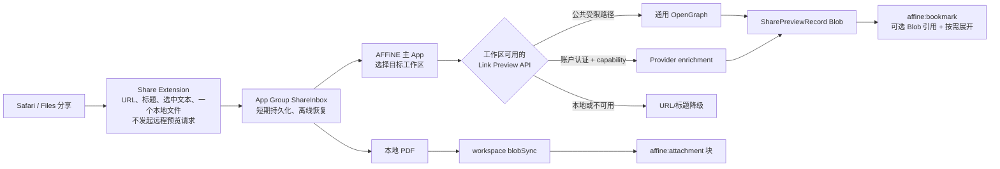

# iOS Share Extension 重构可行性报告

## 2026-08-30 Rich Preview Decision Amendment

This amendment supersedes the no-network and deferred-enrichment constraints below for the
current iOS share-import pull request.

- Product scope now requires a YouTube-rich Share Extension preview and a rich imported
  document, including thumbnail, title, description, author, duration, and transcript when
  the official preview service returns one.
- The user explicitly approved sending shared HTTP(S) URLs to
  `https://app.affine.pro/api/worker/link-preview` from the Share Extension for cloud, local,
  and self-hosted destinations.
- The Extension persists a bounded, validated preview snapshot in Share Inbox schema v3 so
  the main App imports the same data without depending on a second network request.
- Rich document projection uses existing `affine:bookmark`, `affine:paragraph`, and
  `affine:callout` blocks. Gate C remains closed: this amendment does not enable production
  `sharePreviewSourceId` Blob writes or require `ServerFeature.SharePreviewBlobRefs`.
- Network or enrichment failure remains non-blocking and falls back to the existing URL
  bookmark path.
- This amendment closes Gate G for the approved official pre-workspace path. Historical Gate G
  rows, verification notes, and release gates below that prohibit Extension networking or
  `include: ['transcript']` are superseded. Gate C remains independently closed.
- On 2026-08-30, a native-equivalent request without `Origin` or `Referer` returned HTTP 200
  from the production endpoint. The Chinese acceptance URL returned image, favicon, provider,
  title, description, author, published time, duration, and media type; the transcript fixture
  additionally returned transcript segments. The production edge contract is therefore the
  dependency for this client-only change even though the repository's generic Worker fallback
  types remain narrower.

The implementation specification is
[`docs/superpowers/specs/2026-08-30-ios-share-rich-preview-design.md`](superpowers/specs/2026-08-30-ios-share-rich-preview-design.md).

## 评审结论

方案可行，但要拆成两条轨道。**稳定导入 MVP 可直接落地**：Extension 不出网、主 App 按
目标工作区路由通用 OpenGraph、本地 PDF 以附件导入，并用同步事务回执保证恢复不清空用户
内容。**Provider transcript 暂不能直接落地**：仓库尚未选定数据源、凭据、entitlement、
官方/自托管支持矩阵和成本归属；这些决策完成前不得把 transcript 写进 MVP 完成条件。

不能把 `link-preview-js` 放进 Swift Share Extension。它是 Node 运行时依赖，当前仓库只在
Electron 使用。iOS 的通用远程 HTML/OpenGraph 解析应复用当前 Worker 的
`POST /api/worker/link-preview`，并且只能由主 App 发起。

本报告以 `canary@4953682779` 为代码基线，不依赖未合并 PR 的实现。基线 Worker 已具备受限
抓取、缓存、重定向上限和 SSRF 防护，并能解析 OpenGraph 标题、描述、图片和 favicon；
但它**尚未**实现供应商增强或 transcript 返回。`include: ['transcript']` 目前只是请求
类型中的字段，`LinkPreviewResponse` 不含 transcript，控制器也不消费该字段。因此视频
时间点是服务端新增能力，不能作为“复用现有 API 即可得到”的前提。

目标是让 Extension 只收集内容并暂存，主 App 在目标工作区明确后处理网络解析和文档
导入。URL 预览、保存后的文档和卡片摘要必须从同一份已路由的预览结果生成。

## 当前代码约束

| 约束             | 当前事实                                                                                                                                                                                | 设计影响                                                                                                                                                                                                          |
| ---------------- | --------------------------------------------------------------------------------------------------------------------------------------------------------------------------------------- | ----------------------------------------------------------------------------------------------------------------------------------------------------------------------------------------------------------------- |
| Link Preview API | `packages/backend/server/src/plugins/worker/controller.ts` 只返回通用 OpenGraph 数据；`types.ts` 没有 transcript/provider 字段                                                          | 先扩展服务端契约和实现，再在客户端渲染时间点。                                                                                                                                                                    |
| 路由             | `SharePreviewRouteOwner` 的工作区分支能为本地工作区清空端点、自托管工作区使用自己的 Worker、云端使用官方 Worker；但当前 `previewRoute === 'official'` 会在工作区判断前直接固定官方端点  | 这是待修复的隐私缺陷，不是可复用能力。目标实现必须让选定工作区优先，删除或迁移持久化的 `official` 覆盖；选择本地工作区时同步中止在途远程请求。                                                                    |
| Worker 调用来源  | Worker 强制校验 `Origin` 或 `Referer`；全局 CORS 已放行 `capacitor://localhost`，但 Worker 的独立 `allowedOrigins` 尚未包含移动端 origins；原生 `ShareLinkPreviewClient` 也无法满足门禁 | 删除 Extension 的 Worker 请求；主 App WebView 路径必须先让 Worker 复用全局 `buildCorsAllowedOrigins`/`isCorsOriginAllowed` 规则。未来原生访问仍需新的已认证 native ingress，不能伪造浏览器 `Origin`。             |
| 附件块           | `affine:attachment` 使用 `blobSync.set` 得到 `sourceId`，并以 `name/type/size/sourceId/embed` 创建                                                                                      | 本地 PDF 应写入 workspace blob 后创建该块，不能转成 Markdown。                                                                                                                                                    |
| 可展开详情       | 当前 bookmark 没有 JSON Blob 引用或按需展开 API；未知 flavour 会让未注册该 schema 的旧客户端抛出 `ModelCRUDError`                                                                       | MVP 扩展既有 `affine:bookmark` 的可选 props 和视图，不新增 `affine:share-preview` flavour；旧客户端仍能按标准 bookmark 打开链接。                                                                                 |
| PDF 预览         | AFFiNE 文档内是 BlockSuite 附件体验；`QLPreviewController` 不是 Web 文档附件的既有能力                                                                                                  | Extension 可用 PDFKit 生成临时首页缩略图；文档阅读应先沿用 Attachment block。Quick Look 属于独立 iOS 宿主增强。                                                                                                   |
| PDF 输入         | 当前激活规则、Swift `ShareInboxContentKind` 和 TypeScript `PendingShareItem` 只覆盖 URL、文本、图片；Bridge 还会把附件转成 Data URL                                                     | 阶段 2 必须同时扩展激活规则和两端判别联合；PDF 使用文件表示流式复制，阶段 3 直接构造 `Blob/File`，不得走内存放大的 Base64 Data URL。                                                                              |
| Enrichment 边界  | Worker 端点是 `@Public()`，仅有通用限流；当前缓存键只有 URL，未包含 `include` 或契约版本                                                                                                | transcript 上线前必须加入鉴权/授权或明确的匿名配额、Provider 级限流、响应大小上限，并按契约版本、规范化 include、Provider 与授权作用域隔离缓存。                                                                  |
| Enrichment 认证  | `SharePreviewRouteOwner` 当前使用无明确 credential 语义的全局 `fetch`；选定 server 已暴露 `Server.fetch`；公共 Worker CORS 不允许 credential                                            | 两类请求都调用目标 workspace 的 `Server.fetch` 相对路径：公共 OpenGraph 显式 `credentials: 'omit'`，未来 enrichment 使用独立 workspace-scoped 路由和 `credentials: 'include'`，并由该路由返回 credentialed CORS。 |
| 导入重试         | `ImportClipperService` 遇到既有 `documentId` 会打开文档并删除全部子块后重建                                                                                                             | Inbox item 需要文档级提交回执。重试只允许继续同一未提交事务；已提交文档只补做 Inbox 完成，未知或冲突文档绝不清空。                                                                                                |

## 目标架构



### URL 和视频

1. Extension 只保存规范化 URL、原始标题、选中文本以及本地文件生成的临时缩略图，不请求
   Worker 或远程媒体。Extension UI 只显示本地标题、URL host、选中文本和本地附件缩略图；
   删除依赖 `ShareLinkPreview` 的远程卡片、favicon、媒体和 transcript 状态。临时数据只用于
   Extension UI，不能作为导入的权威预览。
2. 用户选定云端或自托管工作区后，主 App 取得该 workspace 对应的 `Server`，统一用
   `Server.fetch` 请求该 server 的相对路径。通用 OpenGraph 保留现有公共受限路径并显式
   `credentials: 'omit'`，请求体仅为 `{ url }`，不得继续发送 `include: ['transcript']`。
   Worker 自身的 Origin 门禁必须复用全局 CORS 的移动端 origin 集合，使
   `capacitor://localhost` 在官方和自托管部署中都能通过；不能要求每个部署额外配置该值。
   Provider enrichment 走独立的 workspace-scoped 认证 capability，
   使用 `credentials: 'include'` 且服务端返回 credentialed CORS。请求和响应要有显式版本化
   契约，失败时保存 URL、
   原始标题和选中文本，不阻塞导入。路由必须先看
   当前选定工作区；删除 `previewRoute === 'official'` 的优先分支并迁移旧 manifest，切换到
   本地工作区时清空端点且中止在途请求。主 App 保存的 preview state 必须同时携带
   `itemId`、workspace key 和 request generation；工作区切换时立即失效旧值，导入只能消费
   与当前目标三者完全匹配的预览。覆盖“A 已成功、切换 B、B 未返回即保存”的测试。
3. 本地工作区没有 Worker 端点，必须直接使用上述降级结果；不得将内容发送到官方服务来
   “补齐”预览，否则会改变本地工作区的隐私边界。
4. 视频 provider、时长和 transcript 是服务端的可选增强字段，不属于可直接实施的 MVP。
   在实现前必须用 ADR 选定 provider adapter、API/抓取来源、秘密配置、官方与自托管支持
   矩阵、entitlement 映射、成本归属和失败语义。受认证请求必须绑定账户、
   workspace server 和 entitlement，官方与自托管分别验证 capability；服务端必须限制 Provider、
   超时、段数、文本字节数和响应总大小；需要成本或用户授权的数据必须校验 entitlement，
   不能只依赖可伪造的 CORS 头。无授权、无字幕、限流、地区限制或解析失败时，仍须正常
   导入通用预览，并标记“详情不可用”，不能生成空内容。
5. enrichment 缓存键至少包含契约版本、规范化后的 `include`、Provider 和授权作用域；带
   用户授权的数据不得进入公共共享缓存，通用 OpenGraph 与 transcript 也不得互相污染。
6. 当前方案明确不支持原生 Extension 首屏的服务端时间点。若产品未来要求该能力，除了
   Extension 内选择工作区和认证，还需新增可审计、可限流的 native ingress；现有 Worker
   的 `Origin`/`Referer` 门禁不能被原生客户端满足，也不能靠伪造请求头绕过。

### 长文本与结构化数据

`DocRecord.setProperty` 是标量文档属性，不适合存储长 transcript。完整 JSON 应作为
workspace blob 保存，但 MVP 不新增 block flavour：在既有 `affine:bookmark` 上增加可选的
`sharePreviewSourceId` 和 `sharePreviewVersion` props，并扩展 bookmark 视图。默认仍显示现有
标题、描述、缩略图和来源；存在引用时才按需读取、限长并校验 JSON Blob。旧客户端忽略增强
props 后仍能打开标准 bookmark，但旧 reader 不会把详情 Blob 计为已引用，执行 unused-blob
永久清理会删除它。云端和自托管服务端还有独立风险：当前
`affine_doc_loader = 0.1.7` 的 native `doc_blob_refs` 投影只识别既有 image/attachment 引用，
服务端对象清理不会因 common reader 的本地索引而受到保护。因此 writer 必须晚于客户端
reader/indexer/transformer 与服务端投影解析器的只读兼容发布，不能因为 bookmark 能渲染就
认为旧客户端或旧服务端完整兼容。该方案仍避免未知 `affine:share-preview` 直接阻断整篇文档。
share-import 对普通网页、YouTube、X 等 URL 一律生成 `affine:bookmark`，不再根据
`EmbedOptionProvider` 改写为 provider embed；否则这些 URL 没有统一位置承载上述引用。
每个 share bookmark 必须写入非空标题，优先级为 routed preview title、用户/manifest title、
URL host。这样本地工作区和预览失败的 bookmark 挂载时不会命中现有“标题和描述均为空则
自动 `refreshData`”路径，不能绕过 `SharePreviewRouteOwner` 再触发编辑器级远程请求。
恢复 share-import 的富媒体 embed 属于后续独立迁移，不能与本 MVP 混用两套详情载体。

```ts
type SharePreviewRecord = {
  version: 1;
  sourceUrl: string;
  title?: string;
  description?: string;
  image?: string;
  provider?: string;
  durationSeconds?: number;
  transcript?: {
    language?: string;
    segments: {
      text: string;
      startSeconds?: number;
      durationSeconds?: number;
      speaker?: string;
    }[];
    chapters?: { title: string; startSeconds: number }[];
    truncated?: boolean;
  };
};
```

JSON Blob 必须设定大小上限、schema 版本、加载失败状态和删除生命周期；common reader/indexer
必须把 bookmark 的 `sharePreviewSourceId` 写入 block 索引的 `blob` 字段，确保现有
unused-blob 页面只会在引用 bookmark 删除后才把它列为未使用。需要为“引用存在”和“引用删除”
各写一个回归测试。bookmark schema 还必须注册 `BookmarkBlockTransformer`，仿照 image/attachment
在 `toSnapshot` 把详情 Blob 加入 assets path map，并在 `fromSnapshot` 写回 Blob；snapshot
导出再导入必须保持详情可用。服务端 4A 在仓内使用现有直接依赖 `y-octo` 扩展
`doc_blob_refs` 的本地投影，把 bookmark `prop:sharePreviewSourceId` 识别为 Blob 引用；继续保留
`affine_doc_loader = 0.1.7` 服务其他调用点，不把本功能阻塞在仓外 crate 发布上。随后将
`doc_blob_refs::PARSER_VERSION` 从 1 升到 2，并让现有 reconciliation 在任何对象清理前重建旧
workspace 投影；投影未完成或失败时沿用当前 fail-closed 语义，禁止标记或删除 Blob。
服务端新增默认关闭的 `flags.sharePreviewBlobRefs` rollout flag。只有在包含该 parser，且同一
部署内所有会执行对象清理的 worker 都已升级到 parser v2 后，运维才打开该 flag，由
`ServerService.onFlagsChanged` 通过既有 `serverConfig.features` 暴露 `SharePreviewBlobRefs`；
滚动部署的混合版本窗口必须保持关闭，回滚前先关闭，不能用部署类型或版本号猜测。

发布分两步：4A 先向所有受支持客户端发布 schema/view、reader 索引和 transformer，同时向
所有支持的官方/自托管服务端发布 parser、投影版本和 capability，但 importer 不写引用；
兼容性负责人确认最低支持客户端已包含 4A 后，本地 workspace 才可启用 4B。云端或自托管
workspace 还必须在当前目标服务器的严格实时配置响应中明确包含 `SharePreviewBlobRefs`；能力
缺失、配置未加载或服务端过旧都必须保持普通 bookmark 降级，不能写详情 Blob 引用。由于
`Server.config$` 是持久化缓存，实际写入前必须通过新增的严格 `Server.fetchFreshConfig(signal)`
实时请求当前服务器，并且只使用该响应中的 capability；不能把缓存值或会吞掉刷新错误的
`waitForConfigRevalidation` 当作成功证明。请求失败、响应缺能力或等待期间 workspace/server
generation 变化时都降级为普通 bookmark。无法提升最低版本或升级目标服务端时，4B 保持
关闭，不能让旧客户端或服务端永久清理破坏数据。
不在无明确产品需求时额外承诺全文搜索或编辑 transcript。若未来产品仍要求独立 `affine:share-preview`
flavour，必须先让所有受支持客户端发布 schema/store/view 的只读支持，再在后续版本启用
writer；单次发布的 feature flag 或旁边多写一个 bookmark 不能解决未知 flavour 异常。

### PDF

1. 接入：更新 `Info.plist` 激活规则、Swift `ShareInboxContentKind`、manifest schema 和
   TypeScript `PendingShareItem`，显式区分本地 PDF 与 Web PDF URL。manifest 升级为 v2；
   自定义解码 v1，缺少 `importAttemptId` 时生成一次并立即原子回写，未知未来版本保留并返回
   `unsupported-version`，不得按损坏文件隔离删除。Store、native Plugin、TypeScript provider
   和控制器使用 `ready | unsupported-version` 判别结果贯通该状态，UI 只提示升级并保留条目。
2. 暂存：先把 `SharePayloadFile` 和 `ShareInboxStore.enqueue` 从仅接收 `Data` 重构为文件
   URL 输入。通过 `NSItemProvider.loadFileRepresentation`（或等价的 in-place 文件 API）取得
   临时文件，在 provider 回调有效期内校验文件 URL、MIME、魔数和大小，并立即流式复制到
   Extension 自己管理的 `affine-share-inbox-staging/<UUID>` 临时目录；draft 只持有这个 owned
   URL，不能持有 provider URL。用户点击保存后，Store 再协调复制到 App Group 的 item 临时
   目录并最后写 manifest。成功保存、取消、替换 draft 和 ViewModel 销毁时删除 owned staging；
   enqueue 失败时为显式重试暂时保留，最终退出时清理，并在下次启动清除超龄残留。不得先用
   `Data(contentsOf:)` 把整个 PDF 载入 Extension 内存；采用
   独立的 `maxShareAttachmentBytes`，不能直接复用编辑器 2 GiB 上限。PDFKit 只渲染首页
   临时缩略图，不提取正文写入 Markdown。
3. 导入：Bridge 返回受校验的绝对 `fileUrl`、用于身份/范围校验的相对路径和元数据，Web 侧
   从 Capacitor file URL 获取
   `Blob/File`；删除当前图片路径使用的 Data URL/Base64 转换。随后调用目标 workspace 的
   `blobSync.set`，以 `name/type/size/sourceId/embed` 添加 `affine:attachment` 块，并应用
   现有 `FileSizeLimitProvider`。`blobSync.set(file)` 已按内容哈希生成稳定 `sourceId`，重试时
   复用同一 Blob；附件块使用由 `importAttemptId` 派生的稳定 block ID，并在写 Blob 前完成
   冲突预检。当前 `BlobEngine.delete()` 不支持真实删除，因此不能承诺失败补偿删除；意外未引用
   Blob 交给现有 unused-blob 清理链路。上传或写块失败时保留 Inbox 项，全部成功后才完成。
   Bridge 改为返回 `File` 时，必须在同一个可构建提交中同步迁移 controller 的附件 state、
   importer 输入和图片预览；图片预览使用 `URL.createObjectURL(file)` 并在切换条目或卸载时
   `URL.revokeObjectURL`，导入路径直接传 `File`。
4. 同次分享中多个二进制附件的第一版策略是明确拒绝，且在 Extension UI 给出提示；不能
   静默丢弃后续附件。
5. 远程 `.pdf` URL 仍只是 URL。当前 Worker 不解析 PDF 正文，也不产生 PDF 缩略图，
   因而第一版应保存 URL/bookmark 降级结果。若需要远程 PDF 预览，另建有大小限制、内容
   类型校验、SSRF 防护和缓存的服务端能力。
6. `Info.plist` 不得在 Web importer、Bridge 和 attachment block 路径全部完成前单独发布 PDF
   激活规则。第一个能够接收本地 PDF 的提交必须同时认识 TypeScript `pdf` 判别、解析 `File`、
   创建附件块并只在 committed 后调用 `complete`；任何中间状态都必须保留 Inbox 项且禁止空导入。

### 导入事务与重试

`documentId` 不能单独充当幂等标识。当前 importer 会打开同 ID 文档、删除全部子块并重建；
如果文档已同步成功但 Bridge `complete` 尚未落盘，用户随后编辑，再次恢复会破坏这些编辑。

每个 Inbox item 必须携带稳定 `importAttemptId`。唯一回执载体固定为同步文档属性。由于
`DocRecord` 只在文档记录存在后可用，`DocsService` 需要提供可在建文档前按 ID 读写的
`getCustomPropertyById`/`setCustomPropertyById`，并让 `DocRecord.setCustomProperty` 返回当前
`DocPropertiesStore.updateDocProperties` 的同步 ORM 写入结果而不是丢弃它。属性键为
`affine:share-import-receipt-v1`，JSON 为
`{ version: 1, attemptId, state: 'preparing' | 'committed' }`。写入后等待
读取前先调用 `waitForDocLoaded('db$docProperties')`，避免把尚未载入的本地回执误判为不存在。
本地持久化始终调用 `workspace.engine.doc.waitForUpdated('db$docProperties')`。在线且根文档已确认
同步时，读取前后都调用 `waitForSynced('db$docProperties')` 作为远端一致性/提交门槛；用户明确确认离线导入时
不能等待远端，而是在 properties/root/content 三个 Y.Doc 都完成 `waitForUpdated` 后提交本地
`committed`，让现有同步引擎稍后上传。

当目标文档记录不存在时，先按 `documentId` 写入并完成上述本地持久化门槛，再调用 `createDoc`；
若进程在两者之间退出，重试可从同一 `preparing` 创建文档。文档已经存在但没有匹配回执时
仍返回冲突。当文档和匹配 `preparing` 都存在后，使用由 `importAttemptId` 派生的稳定 block ID
创建 page/surface/note 骨架和内容节点。首次调用 `createDoc({ skipInit: true })`，避免默认随机
骨架；若崩溃时只有 root 记录落盘而内容 Y.Doc 为空，重试只补齐缺失的稳定骨架并先等待
`waitForUpdated(documentId)`，再 reconcile 叶节点。若内容中存在不匹配的 page/surface/note，
返回 `import-conflict` 而不是覆盖。随后逐项 reconcile，不再
删除全部子块，也不再让 share 路径依赖会生成随机 block ID 的 Markdown 导入。匹配同一
`preparing` 对缺失稳定块执行 create-if-missing；已经存在的稳定块只校验 flavour 和 parent，
绝不更新 props，因此用户修改过的 bookmark URL/标题、选中文本或图片属性不会被覆盖。
匹配 `committed` 只补做 Inbox 完成。目标 ID 已
存在但没有匹配回执、稳定 ID 已被不同 flavour 占用，均返回 `import-conflict`，绝不修改
现有内容。`preparing` 重放对文档元数据也必须单调：只在标题为空时设置标题，只添加目标
标签和目标集合，禁止覆盖非空标题、移除任何标签或把文档移出其他集合。标题要分别读取
root meta title 和稳定 page block title：两者都空才写入导入标题；只有一方为空时用非空一方
补齐；两者都非空但不同时不改任何一方。这样 page 更新已落盘而 root 更新尚未落盘的崩溃
不会在重试时覆盖用户标题。文档同步成功后写入
并同步 `committed`，最后调用 native `complete`；测试覆盖此
两步之间进程退出、Bridge 失败和用户编辑后的重试。

## 执行步骤和提交计划

| 阶段                   | 完成条件                                                                                                                                            | 验证                                                                                                                                            | 建议 commit 信息                                                   | 状态                  |
| ---------------------- | --------------------------------------------------------------------------------------------------------------------------------------------------- | ----------------------------------------------------------------------------------------------------------------------------------------------- | ------------------------------------------------------------------ | --------------------- |
| 0. 隐私与清单基线      | manifest v2 自定义迁移并稳定回填 `importAttemptId`；删除 Extension 网络；Worker 复用全局移动端 Origin；preview 绑定 item/workspace/generation       | Swift/TS/Worker 测试覆盖 v1、未来版本、Capacitor Origin、A→B 未返回即保存、本地/离线；MVP 请求体无 `include`                                    | `refactor(ios-share): make share inbox workspace routed`           | 已完成                |
| 1. 文件型 Inbox 基础   | provider 回调内复制到 Extension-owned staging；将现有图片 payload/store 从 `Data` 改成可注入、受协调的文件 URL 复制；暂不激活 PDF 输入              | XCTest target 正确执行 Store/Builder/ViewModel 延迟保存测试；中断复制不产生 manifest；取消/成功/销毁清理 staging；现有图片分享仍可用            | `refactor(ios-share): stage inbox attachments as files`            | 已完成                |
| 2. 事务与 File Bridge  | 建文档前持久化 `preparing`；稳定骨架/块只补缺失；root/page 标题双源单调协调，标签/集合只加不删；bookmark 始终有标题                                 | 覆盖 root-only/空内容、page-only/root-only/冲突标题、block/元数据编辑、本地 bookmark 零预览请求、图片 Blob 重试                                 | `fix(ios-share): make file imports transactional`                  | 已完成                |
| 3. PDF 端到端启用      | 同一提交更新激活规则、Swift/TS 判别、PDF 校验/缩略图和 attachment importer；禁止缺少 File 或附件块时 `complete`                                     | Swift/TS 测试覆盖 PDF 边界、远程 PDF URL、空导入拒绝、Blob/块复用；真机验证 Files/Safari 分享入口                                               | `feat(ios-share): import shared pdfs as attachment blocks`         | 代码完成，真机待验收  |
| 4A. 详情只读兼容       | 发布 bookmark 可选 props/视图、reader blob 索引和 snapshot transformer；升级服务端 parser、投影版本并暴露 `SharePreviewBlobRefs`；importer 不写引用 | 客户端 fixture/snapshot；native 投影与对象清理测试证明引用存在时保留、删除引用并重建后可清理；GraphQL capability e2e                            | `feat(bookmark): read and retain structured share details`         | 已完成                |
| C. Writer 兼容门槛     | 最低受支持客户端已包含 4A；云端/自托管目标服务器还必须运行时声明 `SharePreviewBlobRefs`                                                             | 发布/兼容性 owner 确认客户端清理兼容；官方与支持的自托管矩阵确认 parser v2 已部署，旧服务器能力缺失时 writer 关闭                               | 不产生代码 commit                                                  | 阻塞                  |
| 4B. 详情 Writer        | C 通过后，本地 writer 按发布门禁开启；云端/自托管仅在严格实时 config 请求成功且当前服务器声明能力时写 Blob 和 bookmark source/version props         | 覆盖 YouTube/X/普通页、失败降级、最低 reader 混用，以及缓存有能力但刷新失败/响应缺能力/切换服务器时不写引用                                     | `feat(ios-share): write structured bookmark details`               | 代码完成，默认关闭    |
| G. Enrichment 决策门槛 | 请求 owner 已确认 cloud/local/self-hosted 均可在 Extension 选择工作区前将共享 URL 发往官方 enrichment endpoint；失败降级为普通 URL                  | 生产 native-equivalent 请求实测 YouTube 有/无 transcript；Swift fixture 固定响应契约和超时/超限/降级                                            | 不产生代码 commit                                                  | 已批准，见顶部修订    |
| 5. Enrichment 实现     | Extension 复用已部署的官方 provider enrichment，持久化有界 v3 快照；主 App 不做第二次请求，标准块投影不依赖 Gate C                                  | Swift/TS 覆盖有/无 transcript、大小限制、媒体代理限制、离线导入和降级；真机抓包确认仅访问官方 preview/image-proxy                               | `feat(ios-share): persist and import rich previews`                | 中文 YouTube 真机通过 |
| 6. 发布收尾            | 六类输入回归，更新隐私/网络说明并关闭评审项                                                                                                         | 定向前端/Swift 测试；`BUILD_TYPE=canary PUBLIC_PATH="/" yarn affine @affine/ios build`；`yarn workspace @affine/ios sync`；Xcode 构建和真机手测 | `docs(ios-share): document routed preview and attachment behavior` | 单例通过，矩阵待验收  |

### 2026-08-30 验证记录

- Worker 定向测试在仓库 Node 22 下使用兼容 ESM loader 和 `--no-worker-threads` 运行，结果
  1/1；前端/reader/BlockSuite 定向测试 255/255、Swift
  `ShareInboxSafetyTests` 77/77、config unit 9/9、config e2e 4/4、native parser
  5/5 和 PostgreSQL 对象清理集成测试 2/2 均通过。
- `yarn typecheck`、变更文件 `oxfmt`、`cargo fmt`、GraphQL 生成物一致性、两个
  BlockSuite package build、canary iOS bundle、Capacitor sync、App 与 ShareExtension
  simulator build 均通过；扩展嵌入校验通过。
- Gate C 尚未通过。生产 writer 的 rollout 常量保持 `false`，自动化覆盖能力缓存过期、实时
  config 失败、服务器/workspace 切换和异步竞态，以上场景均不写
  `sharePreviewSourceId`。
- Gate G 的旧限制已由顶部 2026-08-30 决策修订替代。官方生产 endpoint 已实测返回 provider、
  duration 和可选 transcript；本轮仅在 Extension 获取并持久化有界快照。Gate C 仍关闭，
  不写 `sharePreviewSourceId`。
- `demo_ace_iPhone` 已通过 CoreDevice 连接；当前 canary App 与 ShareExtension 完成 arm64
  签名构建、嵌入校验、覆盖安装和应用启动。中文煎牛排视频完成 Share Extension 和导入验收：
  富卡片包含真实缩略图、YouTube 标识、标题、描述、作者、5:50 时长和 transcript；导入文档
  保持相同 bookmark 内容，并生成 metadata 与带时间戳的 transcript callout。实时 provider
  实际返回了 transcript，因此原计划中的“中文视频无 transcript”假设不成立。Rick Astley、
  无 transcript 实际响应，以及六类输入 × cloud/self-hosted/local 的分享矩阵、Extension 网络
  抓包和本地 workspace 网络抓包尚未执行。单例验收不能替代完整发布矩阵；完成手工矩阵前，
  阶段 3/6 和发布门槛 6 不得标记为完成。

阶段 0-3 是可直接实施、可独立发布的稳定导入路径，4A 在客户端和服务端投影同时完成后可作为
只读兼容版本发布；无 transcript/结构化 writer 时仍可安全保存链接和 PDF。C 通过后才启用
4B，且远端 workspace 逐服务器检查 capability；G 已按顶部修订批准为官方 Extension
enrichment 路径，不改变 Gate C。细粒度文件、测试和 commit 步骤见
[`docs/superpowers/plans/2026-08-29-ios-share-extension-implementation.md`](superpowers/plans/2026-08-29-ios-share-extension-implementation.md)。

## 发布门槛

1. 没有未解决的 P0/P1/P2/P3：保存后无 500、无重复保存弹窗、冷启动不重复恢复已完成的分享。
2. 六类输入均有确定结果：YouTube、X、普通网页、图片、本地 PDF、远程 PDF URL。解析失败时
   保留 URL/标题，不显示空白 `Shared content`。
3. 本地 PDF 是可用附件；远程 PDF URL 不会被 Extension 下载；HTTP(S) URL 可按已批准边界
   提交至官方预览服务，媒体只从官方 image-proxy 获取。
4. Extension 请求可包含 `transcript`，但响应 JSON、字段、段数、媒体字节和像素均受客户端
   限制；失败或无 transcript 时必须保留普通 URL 导入能力。
5. 任意恢复路径都不会清空无匹配事务回执的既有文档；文档已提交但 Inbox 未完成时只补做完成。
6. 通过 Worker、前端和 Swift 定向测试，iOS bundle/sync、Xcode 构建及真机 smoke test。
7. 4A 必须同时交付客户端 reader/snapshot 支持和服务端 parser v2/投影重建能力；Gate C 未确认
   最低支持客户端前，生产 importer 不写 `sharePreviewSourceId`。Gate C 通过后，本地 workspace
   可按发布门禁开启；云端/自托管仅在严格实时 `Server.fetchFreshConfig(signal)` 成功返回、响应
   明确包含 `SharePreviewBlobRefs` 且 workspace/server generation 仍匹配时开启，禁止使用持久化
   `config$` 缓存作为写入授权。snapshot、客户端 unused-blob 和服务端对象清理混合版本验证必须
   通过。
